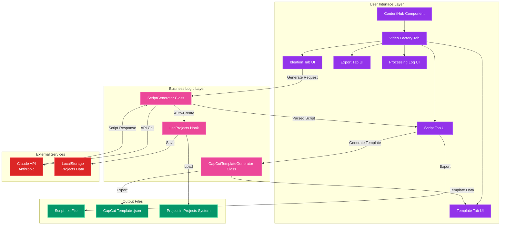
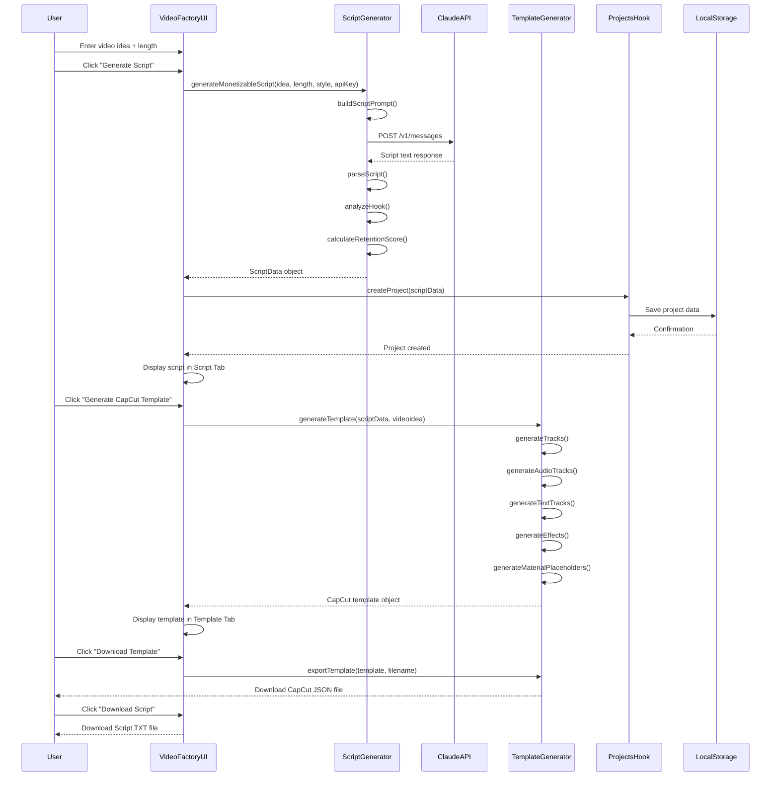
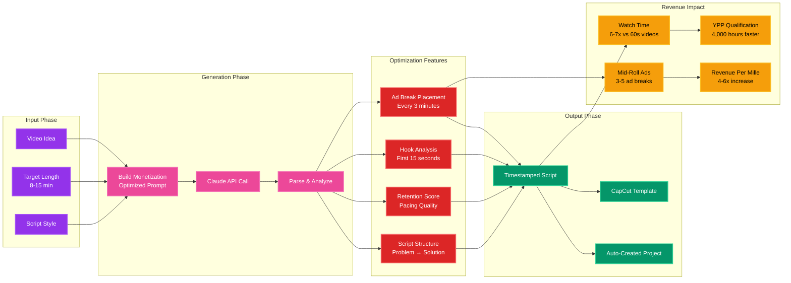

# Video Factory System - Complete Workflow Diagram

```mermaid
flowchart TD
    Start([User Opens Video Factory Tab]) --> IdeationTab[Ideation Tab]
    
    IdeationTab --> InputIdea[Enter Video Idea/Topic]
    InputIdea --> SetLength[Set Target Length: 8-15 min]
    SetLength --> SelectStyle[Select Script Style:<br/>Tutorial / Rant / Case Study]
    SelectStyle --> ClickGenerate[Click Generate Script]
    
    ClickGenerate --> ValidateInput{Input Valid?}
    ValidateInput -->|No| ShowError[Show Error in Log]
    ShowError --> IdeationTab
    
    ValidateInput -->|Yes| CheckAPIKey{API Key<br/>Available?}
    CheckAPIKey -->|No| APIError[Log: API Key Required]
    APIError --> IdeationTab
    
    CheckAPIKey -->|Yes| CallClaude[Call Claude API<br/>ScriptGenerator.generateMonetizableScript]
    CallClaude --> ParseScript[Parse Script Response:<br/>- Extract timestamps<br/>- Identify ad breaks<br/>- Analyze hook strength<br/>- Calculate retention score]
    
    ParseScript --> CreateProject[Auto-Create Project<br/>via useProjects hook]
    CreateProject --> StoreMetadata[Store Metadata:<br/>- Video length<br/>- Ad breaks count<br/>- Retention score<br/>- Hook strength]
    
    StoreMetadata --> SwitchToScript[Switch to Script Tab]
    SwitchToScript --> DisplayScript[Display Generated Script<br/>with Timestamps]
    
    DisplayScript --> ScriptActions{User Action}
    ScriptActions -->|Copy| CopyScript[Copy to Clipboard]
    ScriptActions -->|Download| DownloadScript[Download as .txt]
    ScriptActions -->|Generate Template| GenerateTemplate[Generate CapCut Template]
    
    CopyScript --> ScriptTab[Script Tab]
    DownloadScript --> ScriptTab
    ScriptTab --> ScriptActions
    
    GenerateTemplate --> CapCutGen[CapCutTemplateGenerator<br/>generateTemplate]
    CapCutGen --> CreateTracks[Create Video Tracks:<br/>- Background layer<br/>- Screen recordings<br/>- Character overlay<br/>- Overlay graphics]
    
    CreateTracks --> CreateAudio[Create Audio Tracks:<br/>- Voiceover<br/>- Background music<br/>- Sound effects]
    
    CreateAudio --> CreateText[Create Text Tracks:<br/>- Title card<br/>- Key points<br/>- Subscribe CTA]
    
    CreateText --> CreateEffects[Create Effects Timeline:<br/>- Zoom effects<br/>- Glitch transitions<br/>- Explosion at hook]
    
    CreateEffects --> CreateMaterials[Create Material Placeholders:<br/>- Video assets<br/>- Audio files<br/>- Images/icons]
    
    CreateMaterials --> SwitchToTemplate[Switch to Template Tab]
    SwitchToTemplate --> DisplayTemplate[Display Template Structure]
    
    DisplayTemplate --> TemplateActions{User Action}
    TemplateActions -->|Download| DownloadTemplate[Download CapCut JSON]
    TemplateActions -->|View Details| ViewDetails[View Track Details]
    
    DownloadTemplate --> ExportTab[Export Tab]
    ViewDetails --> TemplateTab[Template Tab]
    TemplateTab --> TemplateActions
    
    ExportTab --> ExportOptions[Export Options:<br/>- Download Script<br/>- Download Template]
    
    ExportOptions --> ProductionWorkflow[Production Workflow Guide:<br/>1. Record voiceover 15-30 min<br/>2. Import CapCut template 2 min<br/>3. Add voiceover + sync 20-40 min<br/>4. Screen record demos 10-20 min<br/>5. Add character overlays 15-25 min<br/>6. Review + adjust 10-15 min<br/>7. Export final video 5-10 min]
    
    ProductionWorkflow --> MonetizationCheck[Monetization Checklist:<br/>✓ 8+ minutes for mid-rolls<br/>✓ Natural ad break points<br/>✓ Strong hook 0-15s<br/>✓ Original content<br/>✓ Thumbnail ready]
    
    MonetizationCheck --> UploadYouTube[Upload to YouTube<br/>via YouTube Tab]
    
    UploadYouTube --> End([Video Published<br/>Monetization Active])
    
    %% Processing Log Flow
    CallClaude -.->|Log| ProcessingLog[Processing Log:<br/>- Processing: Yellow<br/>- Success: Green<br/>- Error: Red<br/>- Info: Purple]
    ParseScript -.->|Log| ProcessingLog
    CreateProject -.->|Log| ProcessingLog
    GenerateTemplate -.->|Log| ProcessingLog
    
    %% Styling
    classDef ideation fill:#9333ea,stroke:#a855f7,stroke-width:2px,color:#fff
    classDef script fill:#ec4899,stroke:#f472b6,stroke-width:2px,color:#fff
    classDef template fill:#dc2626,stroke:#f87171,stroke-width:2px,color:#fff
    classDef export fill:#059669,stroke:#34d399,stroke-width:2px,color:#fff
    classDef process fill:#1e293b,stroke:#475569,stroke-width:2px,color:#fff
    classDef decision fill:#f59e0b,stroke:#fbbf24,stroke-width:2px,color:#000
    
    class IdeationTab,InputIdea,SetLength,SelectStyle ideation
    class SwitchToScript,DisplayScript,ScriptActions,ScriptTab script
    class GenerateTemplate,SwitchToTemplate,DisplayTemplate,TemplateTab template
    class ExportTab,ExportOptions,ProductionWorkflow export
    class CallClaude,ParseScript,CapCutGen,CreateTracks,CreateAudio,CreateText,CreateEffects process
    class ValidateInput,CheckAPIKey,ScriptActions,TemplateActions decision
```

## System Architecture Overview

```mermaid
graph TB
    subgraph UI["User Interface Layer"]
        ContentHub[ContentHub Component]
        VideoFactoryTab[Video Factory Tab]
        IdeationUI[Ideation Tab UI]
        ScriptUI[Script Tab UI]
        TemplateUI[Template Tab UI]
        ExportUI[Export Tab UI]
        ProcessingLogUI[Processing Log UI]
    end
    
    subgraph Business["Business Logic Layer"]
        ScriptGen[ScriptGenerator Class]
        TemplateGen[CapCutTemplateGenerator Class]
        ProjectManager[useProjects Hook]
    end
    
    subgraph External["External Services"]
        ClaudeAPI[Claude API<br/>Anthropic]
        LocalStorage[LocalStorage<br/>Projects Data]
    end
    
    subgraph Output["Output Files"]
        ScriptTXT[Script .txt File]
        CapCutJSON[CapCut Template .json]
        ProjectData[Project in Projects System]
    end
    
    ContentHub --> VideoFactoryTab
    VideoFactoryTab --> IdeationUI
    VideoFactoryTab --> ScriptUI
    VideoFactoryTab --> TemplateUI
    VideoFactoryTab --> ExportUI
    VideoFactoryTab --> ProcessingLogUI
    
    IdeationUI -->|Generate Request| ScriptGen
    ScriptGen -->|API Call| ClaudeAPI
    ClaudeAPI -->|Script Response| ScriptGen
    ScriptGen -->|Parsed Script| ScriptUI
    ScriptGen -->|Auto-Create| ProjectManager
    
    ScriptUI -->|Generate Template| TemplateGen
    TemplateGen -->|Template Data| TemplateUI
    TemplateGen -->|Export| CapCutJSON
    
    ScriptUI -->|Export| ScriptTXT
    ProjectManager -->|Save| LocalStorage
    ProjectManager -->|Load| ProjectData
    
    %% Styling
    classDef ui fill:#9333ea,stroke:#a855f7,stroke-width:2px,color:#fff
    classDef business fill:#ec4899,stroke:#f472b6,stroke-width:2px,color:#fff
    classDef external fill:#dc2626,stroke:#f87171,stroke-width:2px,color:#fff
    classDef output fill:#059669,stroke:#34d399,stroke-width:2px,color:#fff
    
    class ContentHub,VideoFactoryTab,IdeationUI,ScriptUI,TemplateUI,ExportUI,ProcessingLogUI ui
    class ScriptGen,TemplateGen,ProjectManager business
    class ClaudeAPI,LocalStorage external
    class ScriptTXT,CapCutJSON,ProjectData output
```

## Data Flow Diagram

```mermaid
sequenceDiagram
    participant User
    participant VideoFactoryUI
    participant ScriptGenerator
    participant ClaudeAPI
    participant TemplateGenerator
    participant ProjectsHook
    participant LocalStorage
    
    User->>VideoFactoryUI: Enter video idea + length
    User->>VideoFactoryUI: Click "Generate Script"
    
    VideoFactoryUI->>ScriptGenerator: generateMonetizableScript(idea, length, style, apiKey)
    ScriptGenerator->>ScriptGenerator: buildScriptPrompt()
    ScriptGenerator->>ClaudeAPI: POST /v1/messages
    ClaudeAPI-->>ScriptGenerator: Script text response
    ScriptGenerator->>ScriptGenerator: parseScript()
    ScriptGenerator->>ScriptGenerator: analyzeHook()
    ScriptGenerator->>ScriptGenerator: calculateRetentionScore()
    ScriptGenerator-->>VideoFactoryUI: ScriptData object
    
    VideoFactoryUI->>ProjectsHook: createProject(scriptData)
    ProjectsHook->>LocalStorage: Save project data
    LocalStorage-->>ProjectsHook: Confirmation
    ProjectsHook-->>VideoFactoryUI: Project created
    
    VideoFactoryUI->>VideoFactoryUI: Display script in Script Tab
    
    User->>VideoFactoryUI: Click "Generate CapCut Template"
    VideoFactoryUI->>TemplateGenerator: generateTemplate(scriptData, videoIdea)
    TemplateGenerator->>TemplateGenerator: generateTracks()
    TemplateGenerator->>TemplateGenerator: generateAudioTracks()
    TemplateGenerator->>TemplateGenerator: generateTextTracks()
    TemplateGenerator->>TemplateGenerator: generateEffects()
    TemplateGenerator->>TemplateGenerator: generateMaterialPlaceholders()
    TemplateGenerator-->>VideoFactoryUI: CapCut template object
    
    VideoFactoryUI->>VideoFactoryUI: Display template in Template Tab
    
    User->>VideoFactoryUI: Click "Download Template"
    VideoFactoryUI->>TemplateGenerator: exportTemplate(template, filename)
    TemplateGenerator-->>User: Download CapCut JSON file
    
    User->>VideoFactoryUI: Click "Download Script"
    VideoFactoryUI-->>User: Download Script TXT file
```

## Monetization Optimization Flow

```mermaid
flowchart LR
    subgraph Input["Input Phase"]
        Idea[Video Idea]
        Length[Target Length<br/>8-15 min]
        Style[Script Style]
    end
    
    subgraph Generation["Generation Phase"]
        Prompt[Build Monetization<br/>Optimized Prompt]
        API[Claude API Call]
        Parse[Parse & Analyze]
    end
    
    subgraph Optimization["Optimization Features"]
        AdBreaks[Ad Break Placement<br/>Every 3 minutes]
        Hook[Hook Analysis<br/>First 15 seconds]
        Retention[Retention Score<br/>Pacing Quality]
        Structure[Script Structure<br/>Problem → Solution]
    end
    
    subgraph Output["Output Phase"]
        Script[Timestamped Script]
        Template[CapCut Template]
        Project[Auto-Created Project]
    end
    
    subgraph Revenue["Revenue Impact"]
        MidRolls[Mid-Roll Ads<br/>3-5 ad breaks]
        WatchTime[Watch Time<br/>6-7x vs 60s videos]
        YPP[YPP Qualification<br/>4,000 hours faster]
        RPM[Revenue Per Mille<br/>4-6x increase]
    end
    
    Idea --> Prompt
    Length --> Prompt
    Style --> Prompt
    
    Prompt --> API
    API --> Parse
    
    Parse --> AdBreaks
    Parse --> Hook
    Parse --> Retention
    Parse --> Structure
    
    AdBreaks --> Script
    Hook --> Script
    Retention --> Script
    Structure --> Script
    
    Script --> Template
    Script --> Project
    
    AdBreaks --> MidRolls
    Script --> WatchTime
    WatchTime --> YPP
    MidRolls --> RPM
    
    %% Styling
    classDef input fill:#9333ea,stroke:#a855f7,stroke-width:2px,color:#fff
    classDef generation fill:#ec4899,stroke:#f472b6,stroke-width:2px,color:#fff
    classDef optimization fill:#dc2626,stroke:#f87171,stroke-width:2px,color:#fff
    classDef output fill:#059669,stroke:#34d399,stroke-width:2px,color:#fff
    classDef revenue fill:#f59e0b,stroke:#fbbf24,stroke-width:2px,color:#000
    
    class Idea,Length,Style input
    class Prompt,API,Parse generation
    class AdBreaks,Hook,Retention,Structure optimization
    class Script,Template,Project output
    class MidRolls,WatchTime,YPP,RPM revenue
```

